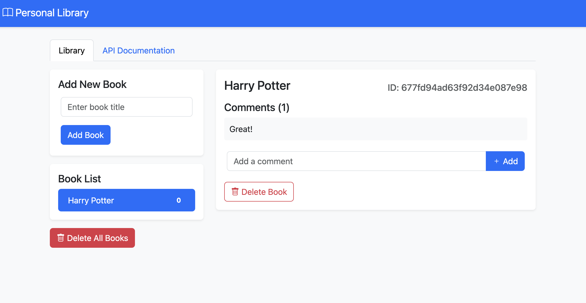

# Personal Library Management System

A full-stack JavaScript application for managing a personal book collection with commenting functionality.



## Technology Stack

### Backend
- **Node.js** - Runtime environment
- **Express.js** - Web application framework
- **MongoDB** - NoSQL database
- **Mongoose** - MongoDB object modeling
- **Helmet** - Security middleware
- **Chai** - Testing framework

### Frontend
- **Bootstrap 5** - UI framework
- **jQuery** - DOM manipulation
- **Bootstrap Icons** - Icon library

## Features

- 📚 CRUD operations for books
- 💬 Comment system for each book
- 🔒 Security features (no caching, headers)
- 📱 Responsive design
- 📖 Interactive API documentation
- ✅ Comprehensive testing suite

## API Endpoints

| Method | Endpoint | Description |
|--------|----------|-------------|
| GET | `/api/books` | Retrieve all books |
| POST | `/api/books` | Add a new book |
| GET | `/api/books/:id` | Get book details |
| POST | `/api/books/:id` | Add comment to book |
| DELETE | `/api/books/:id` | Delete a book |
| DELETE | `/api/books` | Delete all books |

## Getting Started

### Prerequisites
- Node.js (v14 or higher)
- MongoDB (v4.4 or higher)
- npm or yarn

### Installation

1. Clone the repository:
```bash
git clone https://github.com/yourusername/personal-library.git
cd personal-library
```

2. Install dependencies:
```bash
npm install
```

3. Create environment file:
```bash
cp .env.example .env
```

4. Configure environment variables:
```env
NODE_ENV=development
PORT=3000
DB=mongodb://localhost:27017/personal-library
```

5. Start the application:
```bash
npm start
```

Visit `http://localhost:3000` in your browser.

## Testing

### Running Tests
```bash
# Set environment to test
export NODE_ENV=test

# Run all tests
npm test

# Run specific test suite
npm run test:functional
```

### Test Coverage
- Unit tests for database operations
- Functional tests for API endpoints
- Integration tests for full workflow

## Security Features

- No client-side caching
- Helmet.js integration
- Server information obscured
- Input validation
- XSS protection

## Project Structure
```
personal-library/
├── public/
│   ├── client.js
│   └── style.css
├── routes/
│   └── api.js
├── tests/
│   └── functional-tests.js
├── views/
│   └── index.html
├── server.js
└── package.json
```

## Contributing

1. Fork the repository
2. Create a feature branch
3. Commit changes
4. Push to branch
5. Open a Pull Request

## Development

### Local Development
```bash
npm run dev
```

### Database Management
```bash
# Create database backup
npm run db:backup

# Restore database
npm run db:restore
```

## Production Deployment

1. Set environment variables
2. Build assets:
```bash
npm run build
```

3. Start production server:
```bash
npm run start:prod
```

## License

This project is licensed under the MIT License - see the [LICENSE](LICENSE) file for details.

## Acknowledgments

- FreeCodeCamp Information Security and Quality Assurance Certification
- Bootstrap Team
- MongoDB Team

## Contact

Your Name - [@yourusername](https://twitter.com/yourusername)

Project Link: [https://github.com/yourusername/personal-library](https://github.com/yourusername/personal-library)


